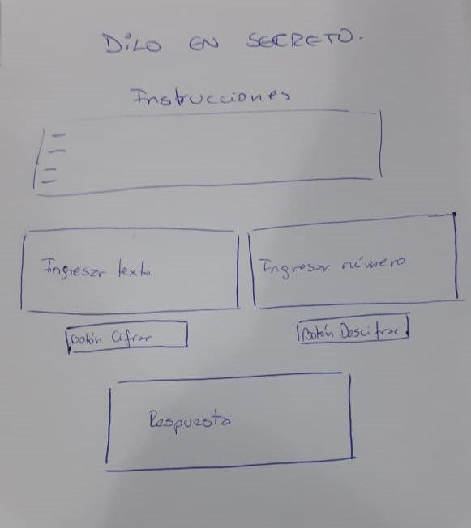

## DILO EN SECRETO

Es una aplicación que sirve para enviar mensajes cifrados a otras personas con la finalidad de que nadie más pueda entender el mensaje.

## Usuarios

"Dilo en secreto" está pensado para cualquier persona que necesite ocultar y enviar un mensaje, sin que otros puedan entender o acceder al contenido.

## Solución a un problema

Mantener una conversación privada y secreta puede resultar muy dificil para algunas personas, por esta razón nace "Dilo en secreto", que permite al usuario mantener frases o conversaciones cifradas con la finalidad de que no puedan ser vistas y entendidas por nadie más que los propios involucrados en la conversación.

## Modo de uso
Para ejecutar la accion, solo se debe ingresar un texto a cifrar, luego elegir un número secreto, el cual indicará el nivel de cifrado, para finalmente obtener la nueva y oculta frase.

## Proceso y decisiones de diseño

Se creó una planificación, la cual se llevó a cabo en cada tarea detalla en el siguiente link de la web Trello: https://trello.com/b/5rZ7zeBV/planificaci%C3%B3n-c%C3%A9sar

Se diseñó un prototipo web en papel, para visualizar como debe quedar finalmente la aplicación. Se optó por un diseño simple y fácil de entender para el usuario.

Imagen de como se ideó el prototipo de la aplicación.

